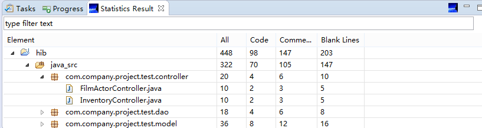

# code-counter-eclipse
Automatically exported from code.google.com/p/code-counter-eclipse

This is an Eclipse plugin to count lines of code(LOC). For now, it can only count LOC of java files. More language types will be added in the future.

Update site: https://raw.githubusercontent.com/Dollyn/code-counter-eclipse/master/update/

